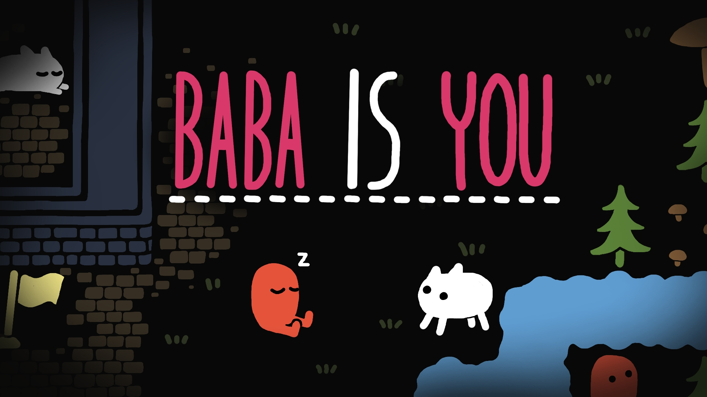

<!DOCTYPE html>
<html>
<title>Cyterski Personal Site</title>
<meta charset="UTF-8">
<meta name="viewport" content="width=device-width, initial-scale=1">
<link rel="stylesheet" href="https://www.w3schools.com/w3css/4/w3.css">
<body class="w3-content" style="max-width:1300px">

<!-- First Grid: Logo & About -->

  

    

      <h1>Logan Cyterski</h1>
    

    

      <a href="#" class="w3-button w3-black w3-block w3-hover-blue-grey w3-padding-16">Home</a>
      <a href="#work" class="w3-button w3-black w3-block w3-hover-teal w3-padding-16">My Hobbies</a>
      <a href="#contact" class="w3-button w3-black w3-block w3-hover-brown w3-padding-16">Contact Me</a>
    

  

  

    

      <h1>About Me</h1>
      
      

        
I'm Logan, a third-year Computational Media major at Georgia Tech.

      

    

  

<!-- Second Grid: Work & Resume -->

  

    

      <h2>My Favorite Shows</h2>
    

    

      

        
      

      

        
      

    

    

      

        
      

      

        
      

    
 
  

  

    

      <h2>My Favorite Games</h2>
      

        

          

            
          

          

            
          

        

        

          

            
          

          

            
          

        
 
      

    

  

        
<!-- Third Grid: Swing By & Contact -->

  

    

      <h1>Socials</h1>
    

    

      
Snap: logandecy

      
Insta: logandorancyterski

    

  

  

    

      <h1>Contact Me</h1>
      <form class="w3-container w3-card w3-padding-32 w3-white" action="/action_page.php" target="_blank">
        

          <label>Name</label>
          <input class="w3-input" style="width:100%;" type="text" required name="Name">
        

        

          <label>Email</label>
          <input class="w3-input" style="width:100%;" type="text" required name="Email">
        

        

          <label>Message</label>
          <input class="w3-input" style="width:100%;" type="text" required name="Message">
        

        <button type="submit" class="w3-button w3-teal w3-right">Send</button>
      </form>
    

  

<!-- Footer -->
<footer class="w3-container w3-black w3-padding-16">
  
Powered by <a href="https://www.w3schools.com/w3css/default.asp" target="_blank">w3.css</a>

</footer>

</body>
</html>

